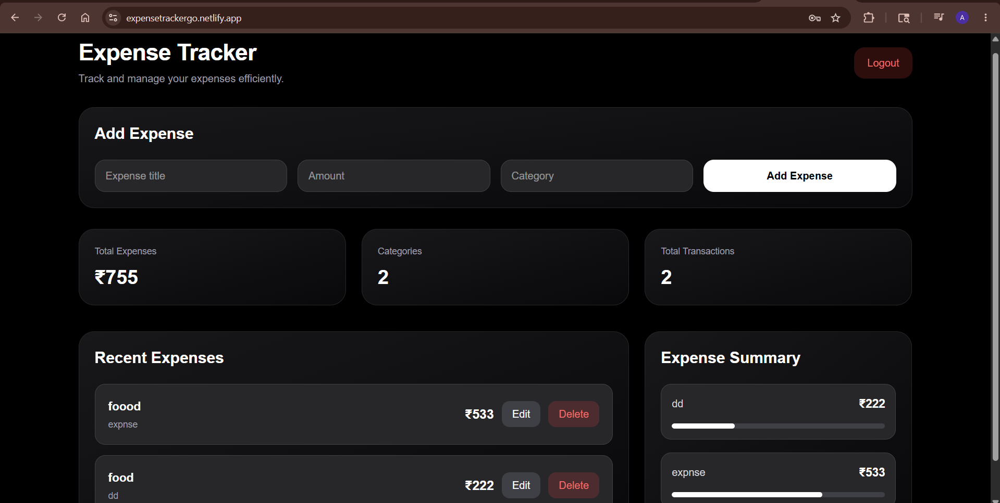
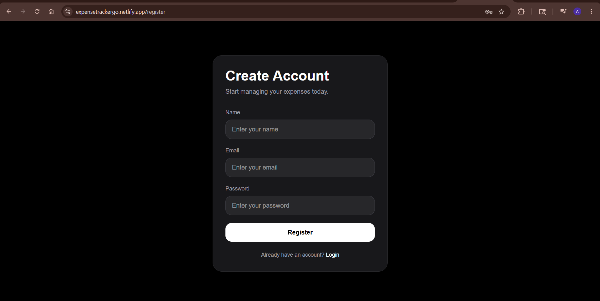
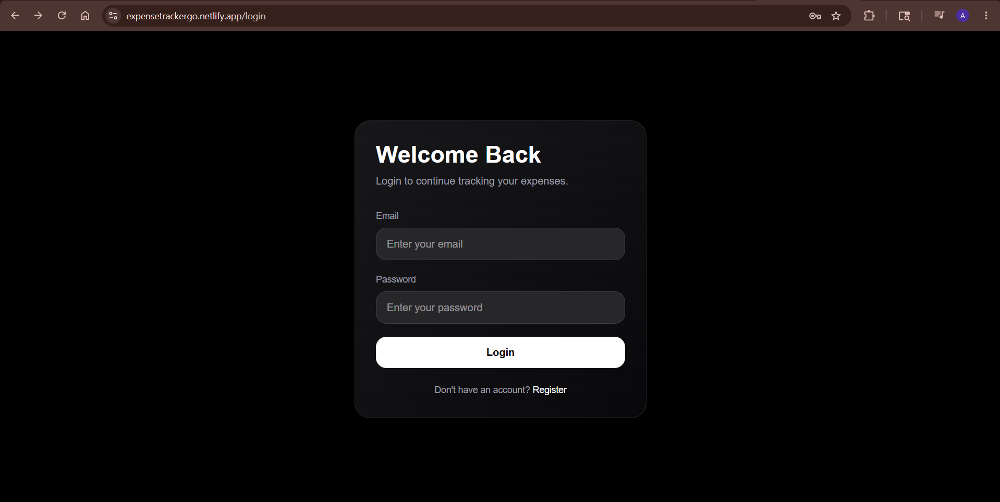

# Expense Tracker 💸

A full-stack Expense Tracker application built using **Go**, **PostgreSQL**, and **Next.js** with **JWT Authentication** and complete expense CRUD functionality.

## 🚀 Live Demo

Frontend: https://expensetrackergo.netlify.app

Backend: https://expensetrackergo.onrender.com



---

# ✨ Features

- 🔐 User Authentication (Register/Login)
- 🪪 JWT-based Authorization
- ➕ Add Expenses
- ✏️ Update Expenses
- 🗑 Delete Expenses
- 📊 Expense Summary Analytics
- 📱 Responsive Modern UI
- 🌙 Dark Theme Dashboard
- ☁️ Deployed Frontend & Backend

---





# 🛠 Tech Stack

## Frontend
- Next.js
- React.js
- Tailwind CSS
- Axios

## Backend
- Golang
- Gorilla Mux
- PostgreSQL
- JWT Authentication
- pgx PostgreSQL Driver

## Deployment
- Netlify
- Render

---

# 📂 Folder Structure

```bash
expense-tracker/
│
├── backend/
│   ├── database/
│   ├── handlers/
│   ├── middleware/
│   ├── models/
│   └── main.go
│
├── frontend/
│   ├── app/
│   ├── lib/
│   └── components/
│
└── README.md
```

---

# ⚙️ Environment Variables

## Backend `.env`

```env
PORT=8080

DATABASE_URL=your_postgresql_database_url

JWT_SECRET=your_secret_key
```

## Frontend `.env.local`

```env
NEXT_PUBLIC_API_URL=https://your-backend-url.onrender.com
```

---

# 🧪 Running Locally

## Clone Repository

```bash
git clone https://github.com/aryanraj13/ExpenseTrackerGo.git
```

---

## Backend Setup

```bash
cd backend

go mod tidy

go run main.go
```

Backend runs on:

```bash
http://localhost:8080
```

---

## Frontend Setup

```bash
cd frontend

npm install

npm run dev
```

Frontend runs on:

```bash
http://localhost:3000
```

---

# 🔑 API Endpoints

## Authentication

| Method | Endpoint | Description |
|---|---|---|
| POST | `/register` | Register user |
| POST | `/login` | Login user |

---

## Expenses

| Method | Endpoint | Description |
|---|---|---|
| GET | `/expenses` | Fetch expenses |
| POST | `/expenses` | Create expense |
| PUT | `/expenses/:id` | Update expense |
| DELETE | `/expenses/:id` | Delete expense |
| GET | `/expenses/summary` | Expense analytics |

---

# 🔒 Authentication Flow

```text
Register → Login → JWT Token → Protected Routes → Expense Dashboard
```

---

# 📈 Future Improvements

- 📅 Monthly Expense Charts
- 📊 Pie Charts & Graphs
- 🔎 Search & Filters
- 📤 Export Expenses
- 🌍 Multi Currency Support
- 👤 User Profile Settings

---

# 👨‍💻 Author

Aryan Rajput

GitHub: https://github.com/aryanraj13
```